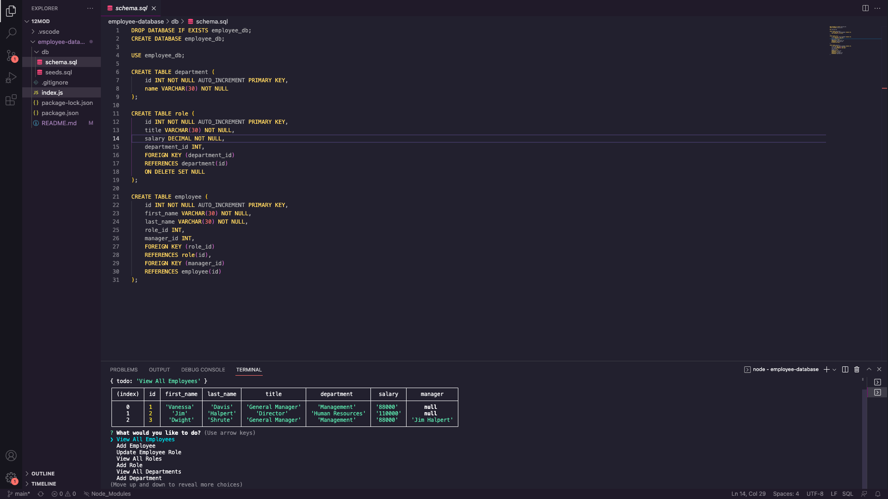

# employee-database

## Description

This application was designed for companies to keep track of their different departments, roles, and employees.

## Table of Contents

- [Installation](#installation)
- [Usage](#usage)
- [Credits](#credits)
- [License](#license)

## Installation

- Inquirer NPM Package 
- MySQL2 NPM Package

## Usage

To use this this application, you must first consult the installation section of this README and download the two requirements.  You must source the seeds.sql and schema.sql files into your mySQL database before running the applications. Then, to start the app, run "node index.js" in your terminal. You will have the option to either:
- View All Employees
- Add Employee
- Update Employee Role
- View All Roles
- Add Role
- View All Departments
- Add Department
- Quit

## Credits

N/A

## License

N/A